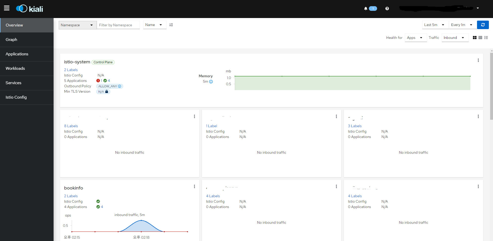
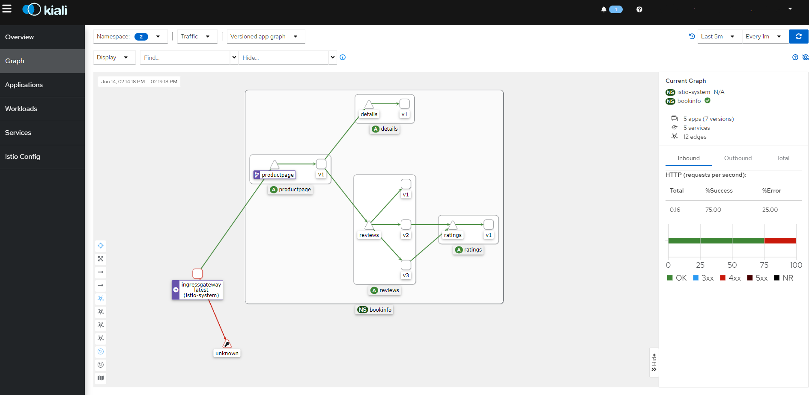

# Kiali 설치 가이드

## 개요

- Service mesh(istio) topology 및 트래픽 관리를 시각화한다.
- Mesh, Cluster, Network, Workload에 기반한 topology Graph, UI를 통한 트래픽 테스트, Envoy config/Log, Jaeger Integration 등 Service Mesh 시각화를 제공한다.

## 구성 요소 및 버전

* kiali ([quay.io/kiali/kiali:v1.59.0](https://quay.io/repository/kiali/kiali?tab=tags))

## Prerequisites

* 필수 모듈
  * [istio](https://github.com/tmax-cloud/install-istio/tree/5.2)

## 폐쇄망 설치 가이드
설치를 진행하기 전 아래의 과정을 통해 필요한 이미지 및 yaml 파일을 준비한다.
1. **폐쇄망에서 설치하는 경우** 사용하는 image repository에 istio 설치 시 필요한 이미지를 push한다.

    - [install-registry 이미지 푸시하기 참조](https://github.com/tmax-cloud/install-registry/blob/5.0/podman.md)
2. install yaml을 다운로드한다.
    ```bash    
    $ wget https://raw.githubusercontent.com/tmax-cloud/install-kiali/5.2/yaml/kiali.yaml
    ```

---

## Install Steps

## 0. istio 확인

* 목적 : `istio system namespace, pod 확인`

```bash
$ kubectl get ns istio-system # 네임스페이스 확인
$ kubectl get pod -n monitoring # pod 확인
```

* 설치가 안되어 있다면 istio 설치를 참고하여 설치
  * https://github.com/tmax-cloud/install-istio
  * 5.2 브랜치에서 설치되는 kiali 버전은 v1.59.0으로 istio 1.15에 호환되기 때문에 알맞은 istio 버전을 설치하여야 한다. 이 [링크](https://kiali.io/docs/installation/installation-guide/prerequisites/)를 통해 호환 버전을 확인할 수 있다.

---

## 1. KEYCLOAK 연동

1. client 생성
   - 필요 설정
     - Implicit Flow Enabled (ON)
     - Access Type: confidential
     - valid Redirect URIs : *


2. Client-Client Scopes 설정
   - Available Client Scopes에 있는 kubernetes 선택 및 Add selected


---

## 2. kiali.config 설정 ([파일](./kiali.config))

   ```config
   kialiVersion=v1.59.0
   hyperAuthIP='' # 키클록 URL ex) hyperauth.tmaxcloud.org
   clientId='' # 키클록 클라이언트 이름 ex) kiali
   customDomainName='' # 도메인 ex) tmaxcloud.org
   kialiLoglevel=info # ex) trace, debug, info, warn, error, fatal
   ```

---

## 3. Installer 실행

* 목적 : `kiali 설치 실행 `

* 생성 순서 : 아래 command로 설치 yaml 적용
   ```bash
   $ chmod +x installer.sh
   $ ./installer.sh install
   ```

### 삭제 가이드

```bash
$ chmod +x installer.sh
$ ./installer.sh uninstall
```


## Example Test: bookinfo 예제
* 목적: istio 및 kiali 설치 검증을 위한 bookinfo 예제
### 1. bookinfo yaml 배포
* bookinfo 예제를 배포할 namespace를 만들고, istio-injection=enable label 추가 후 bookinfo 예제를 배포한다.
```bash
$ kubectl create ns bookinfo
$ kubectl label ns bookinfo istio-injection=enabled
$ kubectl apply -f bookinfo.yaml -n bookinfo
```
### 2. bookinfo gateway, virtual service 설정
* istio-ingressgateway를 통해 들어올 트래픽의 진입점을 gateway로 설정하고,<br/>
해당 gateway에서 라우팅할 서비스 endpoint를 virtual service를 통해 등록한다.
```bash
$ kubectl apply -f bookinfo-gateway.yaml -n bookinfo
$ kubectl apply -f bookinfo-virtualservice.yaml -n bookinfo
$ kubectl get virtualservice -n bookinfo 

NAME       GATEWAYS               HOSTS                    AGE
bookinfo   ["bookinfo-gateway"]   ["bookinfo.demo.test"]   21m
```
### 3. bookinfo 호출
* curl 커맨드를 통해 bookinfo 예제를 호출하여 트래픽을 생성한다. <br/>
(istio sampling 설정에 따라 반복 호출이 필요할 수도 있다.)
```bash
$ curl -H "Host: bookinfo.demo.test" http://YOUR_INGRESSGATEWAY_ADDR/productpage
```
### 4. 검증
* 정상적으로 호출되어 트래픽이 발생했다면 아래와 같은 화면을 볼 수 있다.




이를 통해 해당 트래픽에 대한 topology를 확인할 수 있다.

## External Service와 연동 (jaeger, grafana)
kiali configMap의 필드값 변경으로 external service들과 kiali를 연동할 수 있다.
#### 기본값
```yaml
      tracing:
        url:
        in_cluster_url: http://jaeger-query.istio-system.svc:16685
      grafana:
        url:
        in_cluster_url: http://grafana.monitoring:3000
      prometheus:
        url: http://prometheus-k8s.monitoring:9090
```

