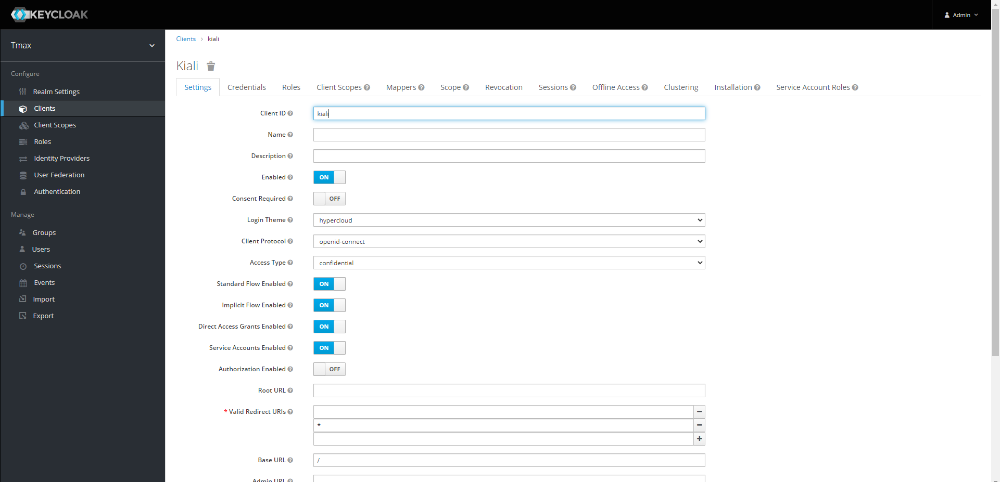
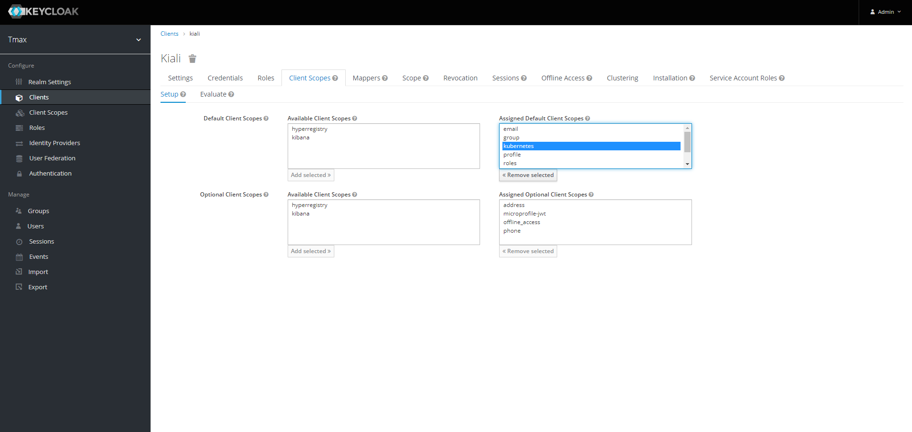

# Kiali 설치 가이드

## 개요

- Service mesh(istio) topology 및 트래픽 관리를 시각화한다.
- Mesh, Cluster, Network, Workload에 기반한 topology Graph, UI를 통한 트래픽 테스트, Envoy config/Log, Jaeger Integration 등 Service Mesh 시각화를 제공한다.

## 구성 요소 및 버전

* kiali ([quay.io/kiali/kiali:v1.21](https://quay.io/repository/kiali/kiali?tab=tags))


## Prerequisites

## 폐쇄망 설치 가이드
설치를 진행하기 전 아래의 과정을 통해 필요한 이미지 및 yaml 파일을 준비한다.
1. **폐쇄망에서 설치하는 경우** 사용하는 image repository에 istio 설치 시 필요한 이미지를 push한다.

    - [install-registry 이미지 푸시하기 참조](https://github.com/tmax-cloud/install-registry/blob/5.0/podman.md)
2. install yaml을 다운로드한다.
    ```bash    
    $ wget https://raw.githubusercontent.com/tmax-cloud/install-kiali/5.0/yaml/kiali.yaml
    ```

---

## Install Steps

## 0. istio 확인

* 목적 : `istio system namespace, pod 확인`

```bash
$ kubectl get ns istio-system # 네임스페이스 확인
$ kubectl get pod -n monitoring # pod 확인
```

* 설치가 안되어 있다면 istio 설치를 참고하여 설치
  * https://github.com/tmax-cloud/install-istio

---

## 1. KEYCLOAK 연동

1. client 생성
   - 필요 설정
     - Implicit Flow Enabled (ON)
     - Access Type: confidential
     - valid Redirect URIs : *



2. Client-Client Scopes 설정
   - Available Client Scopes에 있는 kubernetes 선택 및 Add selected



---

## 2. kiali.config 설정 ([파일](./kiali.config))

   ```config
   kialiVersion=v1.21
   hyperAuthIP='' # 키클록 URL ex) hyperauth.tmaxcloud.org
   clientId='' # 키클록 클라이언트 이름 ex) kiali
   customDomainName='' # 도메인 ex) tmaxcloud.org
   ```

---

## 3. Installer 실행

* 목적 : `kiali 설치 실행 `

* 생성 순서 : 아래 command로 설치 yaml 적용
   ```bash
   $ chmod +x installer.sh
   $ ./installer.sh install
   ```

### 삭제 가이드

```bash
$ chmod +x installer.sh
$ ./installer.sh uninstall
```


## Log level 설정 가이드

Deployment command의 verbose를 조정한다.

- 3: default(info , [info,warn,error,fatal])
- 4: debug
- 5: trace

```yaml
containers:
- command:
	- /opt/kiali/kiali
	- -config
	- /kiali-configuration/config.yaml
	- -v
	- "3" # info
```

