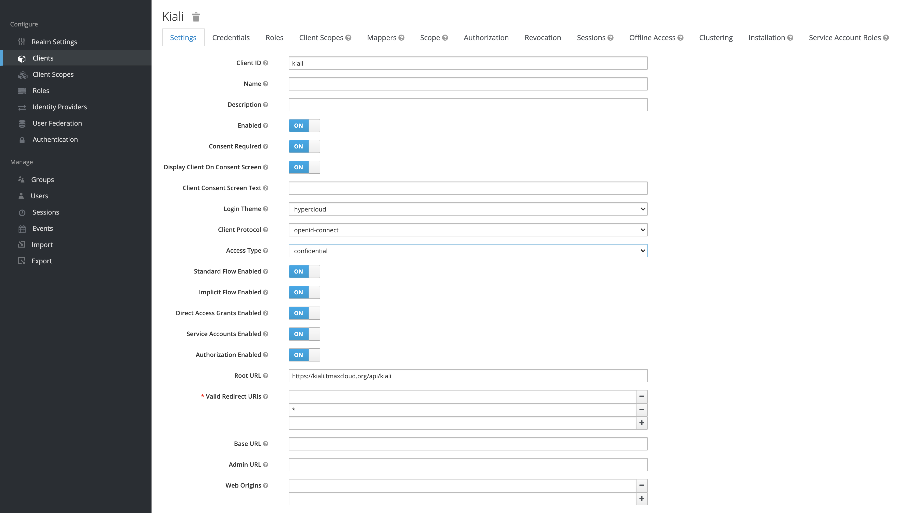

# Kiali 설치 가이드

## 구성 요소 및 버전
* kiali ([quay.io/kiali/kiali:v1.38](https://quay.io/repository/kiali/kiali?tab=tags))

## Prerequisites

## 폐쇄망 설치 가이드
설치를 진행하기 전 아래의 과정을 통해 필요한 이미지 및 yaml 파일을 준비한다.
1. **폐쇄망에서 설치하는 경우** 사용하는 image repository에 istio 설치 시 필요한 이미지를 push한다.
    
    - [install-registry 이미지 푸시하기 참조](https://github.com/tmax-cloud/install-registry/blob/5.0/podman.md)
2. install yaml을 다운로드한다.
    ```bash    
    $ wget https://raw.githubusercontent.com/tmax-cloud/install-kiali/5.0/yaml/kiali.yaml
    ```


## Install Steps
1. [istio 확인](https://github.com/tmax-cloud/install-kiali/blob/5.0/README.md#step-1-istio-%ED%99%95%EC%9D%B8)
2. [kiali 설치](https://github.com/tmax-cloud/install-kiali/blob/5.0/README.md#step-2-kiali-%EC%84%A4%EC%B9%98)

## Step 0. Keycloak 연동

* 목적 : `Keycloak 연동`

* 생성 순서 : 

  * Keycloak Client 생성

    

    - `Root URL = https://${DOMAIN}/api/kiali`

    - `Valid Redirect URIs = * `

  

## Step 1. yaml 수정

* 목적 : `yaml에 이미지 , registry 정보를 수정`

* 생성 순서 :
    * 아래의 command를 수정하여 사용하고자 하는 버전 정보를 수정한다.
	```bash
	$ export KIALI_VERSION=1.38
	$ export KIALI_HELM_VERSION=1.38.0
	$ export KEYCLOAK_ADDR={KEYCLOAK_ADDR} 
    $ export CLIENT_ID={CLIENT_ID} # keycloak CLIENT_ID 
    $ export CLIENT_SECRET={CLIENT_SECRET} # keycloak Client > kiali > Credentials > Secret 값
    $ export DOMAIN={DOMAIN} # Hypercloud 주소
    
	$ sed -i 's/{KIALI_VERSION}/'${KIALI_VERSION}'/g' kiali.yaml
	$ sed -i 's/{KIALI_HELM_VERSION}/'${KIALI_HELM_VERSION}'/g' kiali.yaml
	$ sed -i 's/{KEYCLOAK_ADDR}/'${KEYCLOAK_ADDR}'/g' kiali.yaml
	$ sed -i 's/{CLIENT_ID}/'${CLIENT_ID}'/g' kiali.yaml
	$ sed -i 's/{KEYCLOAK_ADDR}/'${KEYCLOAK_ADDR}'/g' kiali.yaml
	$ sed -i 's/{CLIENT_SECRET}/'${CLIENT_SECRET}'/g' kiali.yaml
	$ sed -i 's/{DOMAIN}/'${DOMAIN}'/g' kiali.yaml
	
	```
	
* 비고 :
    * `폐쇄망에서 설치를 진행하여 별도의 image registry를 사용하는 경우 registry 정보를 추가로 설정해준다.`
	```bash
	$ sed -i 's/quay.io\/kiali\/kiali/'${REGISTRY}'\/kiali\/kiali/g' kiali.yaml
	$ sed -i 's/docker.io/'${REGISTRY}'/g' bookinfo.yaml
	```

## Step 1. istio 확인
* 목적 : `istio system namespace, pod 확인`

```bash
$ kubectl get ns istio-system # 네임스페이스 확인
$ kubectl get pod -n monitoring # pod 확인
```

* 설치가 안되어 있다면 istio 설치를 참고하여 설치
  * https://github.com/tmax-cloud/install-istio


## Step 2. kiali 설치
* 목적 : `istio ui kiali 설치`
* 생성 순서:
    * [kiali.yaml](yaml/kiali.yaml) 실행 `ex) kubectl apply -f kiali.yaml`
    * kilai pod가 running임을 확인한 뒤 http://$KIALI_URL/api/kiali 에 접속해 정상 동작을 확인한다.
* 비고 :
    * kiali에 접속하기 위한 서비스를 [원하는 타입](yaml/2.kiali.yaml#L346)으로 변경할 수 있다.
    * kiali에 접속하기 위한 방식을 [strategy](yaml/2.kiali.yaml#L184)를 configmap을 수정해 변경할 수 있다.    
    * hypercloud console 과 연동을 위해 kiali default web_root가 /kiali 에서 /api/kiali로 수정되었다.


